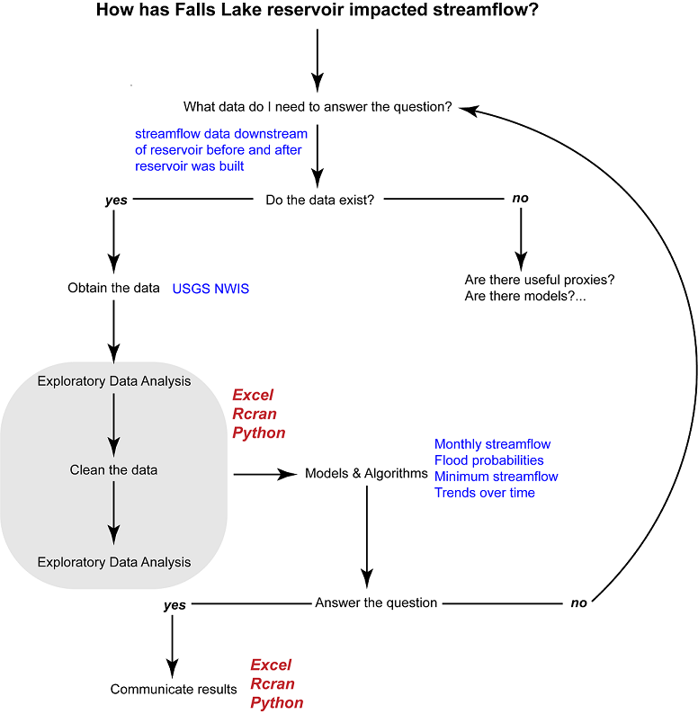
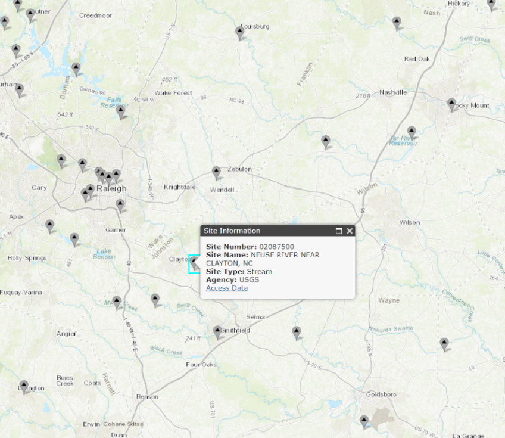

# Unit 1: Streamflow Data

---

## Excel Exercise:

### What data do I need? & Do the data exist?

1.  Find daily discharge data for a site downstream of Falls Lake Reservoir

    a.  USGS NWIS: Mapper (https://maps.waterdata.usgs.gov/mapper/index.html)

        i.  Zoom into Falls Lake Reservoir and trace downstream. Noting the site number and site name.

{width="5.666463254593176in" height="4.908333333333333in"}

**Figure:** Snapshot of NWIS Mapper. Falls Lake is in the upper left corner. Clayton is the next site downstream of the reservoir. As are Smithfield and Goldsboro. Notice that as you move downstream additional streams join the Neuse River, complicating the signal from Falls Lake.

1.  Find the daily discharge data for the Neuse River near Clayton, NC

    a.  Click on the "Access Data" Button on NWIS Mapper

    b.  USGS NWIS select NC, Daily Data, Discharge, search for "Clayton" or the Site Number (02087500)

    c.  Google USGS Neuse River near Clayton

### Obtain the data

1.  Download daily discharge data from 10-01-1930 to 9-30-2017 (October to September is the Water Year)

    a.  Select parameter of interest (Discharge)

    b.  Select output format (tab-separated)

    c.  Select dates

2.  Notice the metadata provided

3.  Notice the URL. Certain parameters in that link can be changed to download other data. For example, change the site\_no to: 02089000. What data appeared on the website?

4.  Copy and paste *all* the data into excel

    a.  To select all: Go to top left corner of website, highlight a little corner. Press CTRL+SHIFT+END

    b.  In Excel Right click, paste special, text

        i.  Notice the data are in different columns

> OR...

a.  Paste (CTRL+V)

    i.  Notice the data are in a single column

    ii. Highlight the column (click on first row where data starts and press CTRL+SHIFT+Down Arrow)

        1.  In menu DataText to ColumnsDelimitedSpaceFinish

            a.  Notice the data are in columns now, but the column headers don't match the data fields until 2004 when minimum and maximum discharge were collected. Need to be careful for these types of errors using this method. I recommend the previous method.

    iii. Delete this one (highlight column letters, Right Click, Delete)

b.  Name this tab "Raw"

    i.  Double click tab and type in "Raw"

c.  Save spreadsheet

# Exploratory Data Analysis

## Plot Streamflow Data (are there obvious gaps or outliers)

1.  Copy worksheet and paste as a new sheet. Name this tab "EDA".

    a.  Right click Move or Copy Select Create a Copy (move to end) OK

    b.  Remove metadata rows

        i.  Highlight row numbers Right Click Delete

        ii. Delete the second row (not data but 5s, 15s, etc.)

2.  Do *not* change anything in the Raw data tab moving forward.

3.  We are interested in only the *mean* discharge.

    a.  Delete all columns except site\_no, datetime, and mean discharge

    b.  Change the "datetime" column name to "Date"

    c.  Change the discharge column name to: "Mean Flow (cfs)"

        i.  Always include the units in the column name. The unit information is located in the metadata in the "Raw" tab.

4.  Create a scatter plot of discharge over time.

    a.  Highlight on B1 and C1 Press CTRL+Shift+Down Arrow In Menu Select Insert hover over scatter plot options and select the appropriate plot given the data.

        i.  Should be Straight Lines because a lot of data based on measurements

        ii. Notice the x-axis needs formatting. Double click the x-axis. Notice the Bounds go from 0 to 50,000. This represents the number of days starting January 1^st^ 1900 to December 31^st^ 2036. You can adjust the bounds to match your date range or you can try a different chart.

    b.  In the Menu Design Change Chart Type Line

        i.  Notice you can get a preview of what the charts will look like

    c.  Make the graph pretty/meaningful

        i.  Change the title to something meaningful, such as "Neuse Streamflow near Clayton, NC"

        ii. Add a y-axis label

            1.  Menu Design Add Chart Element Axis Titles Primary Vertical

            2.  Provide a meaningful label, such as "Streamflow (cfs)"

        iii. Change y-axis labels

            1.  Double click on the y-axis labels

                a.  Axis OptionsBounds Change Maximum to 23000

                    i.  Notice the minimum changed to -2000, change to 0.

                    ii. Display units in thousands

        iv. Delete gridlines

        v.  You can play around in Design / Format to change colors, font-size, borders, etc.

            1.  Try changing the line width -- make it smaller to get more details

5.  You remembered that scientists like the metric system and you need to convert the data from cubic feet per second to cubic meters per second.

    a.  Add a header in column D: "Mean Flow (cms)"

    b.  Find the unit conversion rate (0.028316847)

    c.  Convert cfs to cms in the following row

        i.  D2=C2\*conversion rate

        ii. Highlight D2 and double click on the bottom right corner button

    d.  Scroll down to make sure the data filled correctly. Notice you can't see the labels for your columns anymore.

        i.  CTRL + HOME

        ii. Highlight Row 1, Menu View Freeze Panes Freeze Top Row

            1.  Scroll down again.

6.  Replot the graph

    a.  Click on the graph grab the highlighted blue box and drag it over to column D

    b.  Change the y-axis label and bounds

    c.  Reformat as needed...

7.  Your general manager looks at the chart but he doesn't like the metric system. Add a new column to convert to millions of gallons per day. Make a new plot and show side by side.

    a.  1 CFS = 0.53817 MGD

## Summarize and Plot Streamflow Data

1.  What can you say about this site? Not a whole lot yet, so let's do some more exploring.

2.  How confident are we in the data?

    a.  We deleted the confidence markers from the original data. Let's add those back in.

    b.  Column F add a header: "Confidence"

        i.  You can copy and paste because we haven't moved things around -- but a useful trick when you are matching data together by a unique identifier is "VLOOKUP".

            1.  Vlookup(unique identifier,

> highlight table you want to get data from with first column being the unique identifier,
>
> number of columns to the data you want to grab,
>
> FALSE)

i.  In F2 type: =VLOOKUP(B2,Raw!\$C\$34:\$I\$31810,7,FALSE)

    1.  Dollar signs lock the table in place -- otherwise the range would move up or down depending on the cell.

    2.  Double click the bottom corner to grab information for the entire table

<!-- -->

a.  How many observations are there?

    i.  Below the charts, add a label and then Use the count function in the adjacent cell

b.  How many observations were in each qualification code?

    1.  Look at raw data to get the qualification code

    2.  Use the "COUNTIF" function

        a.  =COUNTIF("data range", Value)

        b.  Add \$ and copy/paste, changing the value

c.  What percentage of observations fall into each category?

    i.  How do you know what categories to use? Go to the raw dataDataFilter

    ii. Look at column I to see what variables are present and compare to metadata in row 28-30

d.  How confident are we in the quality of the data at this location?

<!-- -->

1.  Summary Statistics

    a.  Create the table skeleton with labels

        i.  Min(range)

        ii. Percentile(range,0.1)...0.25, 0.75, 0.90 (copy and paste with \$)

        iii. Median(range)

        iv. Average(range)

        v.  Max(range)

    b.  Did the summary statistics change with the construction and filling of Falls Lake Reservoir (1980-1983)?

        i.  A quick way to do this is search for 1980 and select 12/31/1979 and up with CTRL+SHIFT+Up Arrow. Then search for 1948 and select from 1/1/1984 and down. Use \$ signs and repeat the above.

        ii. What do you notice? Particularly with regards to min and max streamflow. Does that make sense given what you know about reservoirs?

2.  Is there seasonal variation in streamflow?

    a.  Parse out the Date to include Year and Month and Water Year

        i.  Insert three columns. On Column C Right Click Insert

        ii. Give them appropriate column names

            1.  =YEAR()

                a.  Fix the format from date to number

            2.  =MONTH()

            3.  Water year runs from October to September. How can we adjust the year column to account for this information?

                a.  Use If()

                b.  Scroll downwards to make sure your answer worked

    b.  Create Table Skeleton of average streamflow by month over the different time periods

        i.  AVERAGEIF(Value Range, Value, Average Range)

        ii. Plot for the period of record, prior to 1980, and after 1984

    c.  Plot Results

        i.  What do you observe?

    d.  Repeat the above using SUMIF for annual streamflow based on the water year.

# Has the reservoir impacted the 100 year flood frequency?

{width="6.5in" height="2.4833333333333334in"}

**Figure:** Reservoirs should moderate downstream flows. There is a flood control pool to hold flood waters that can be released slowly over time. There is also a conservation pool that holds water that can be released downstream during drier conditions to meet minimum streamflow requirements.

Flood insurance policy is built around the concept of the 100-year flood event. The housing industry has been working to explain what that risk actually means to homeowners with 30 year mortgages.

{width="6.25in" height="2.9583333333333335in"}

Reservoirs decrease the likelihood of downstream flooding, but that often means development occurs in areas that would have been frequently flooded prior to the reservoir. We've seen examples of this just his year with Hurricane Harvey.

## Understand what analyses are needed to answer the question.

1.  Research how to calculate the 100 year flood return interval. We will use Leopold's (1994) flood frequency curve and the Weibull equation to calculate the recurrence interval.

    a.  Return Interval: (n+1)/m where n is the number of years of data and m is the rank of the year from largest (1) to smallest (n).

        i.  \*\*\*The accuracy of a return interval is highly impacted by the length of the time series.

2.  Calculate the maximum annual streamflow

    a.  Pivot table

    b.  Highlight your table Menu Insert PivotTable New Worksheet OK

        i.  Rename worksheet "Flood"

    c.  Click on the Pivot Table

        i.  Rows = Years

        ii. Values = Mean Discharge (cms)

            1.  Change value from sum to max (double click in the values box and go to value field settings)

    d.  Copy and paste values (right click + s + v) nearby. Change column names to something meaningful. Add header: "Period of Record (1931-2017)"

3.  Sort the data from max to min based on the Peak Flow (cms).

    a.  Menu Sort Max Value Largest to smallest

4.  Add a new column and rank the flood events starting from 1 downward

    a.  Enter 1, 2, 3. Then highlight cells and double click bottom right corner to finish ranking

5.  Calculate the Recurrence Interval

    a.  RI = (n+1)/m; where n is the number of years of data and m is the rank

        i.  How many years of data do we have?

6.  Calculate the Annual Exceedance Probability for each return interval

    a.  Pe = 1/RI

7.  Calculate the probability of the 100 and 500 year flood occurring over the next 30 years as a binomial distribution

    a.  Pe = 1 -- \[1-(1/T)\]^n^, where T is the return period (e.g. 100 years) and n is the number of years of interest.

8.  Plot your recurrence interval on the x-axis and your max discharge on the y-axis

    a.  Place the x-axis on a log scale and add minor tick marks

    b.  Add a regression and find the one with the best fit (excluding polynomial and moving average).

        i.  Right click on the data points and select add trendline

    c.  Using the best-fit regression -- estimate the discharge for the 100-year, 500, and 1000 year events

    d.  Add those events to the chart as markers.

        i.  Select Data Add RI Year goes to X Values, Y Values are the POR equation

## Calculate Return Period for 100 year Flood Using Data Prior to 1980

1.  Repeat the above analysis only using data prior to 1980 to calculate the return interval

    a.  How many fewer years of data are used?

2.  Plot the new dataset on top of the original plot

    a.  Menu Design Select Data Add

    b.  Add the estimated 100 and 500 year points for each plot based on the regression

3.  How big is the difference between the 100 and 500 year estimates?

    a.  Percent is calculated relative to the smaller record (my choice)

4.  Calculate the discharge for different return periods and exceedance probabilities

5.  Plot annual discharge and calculate the number of times the 100 year flood was surpassed for both the POR and prior to 1980.

    a.  Plot the estimates on the same chart. How much do they differ? Are you surprised by the results?

    b.  Look at the first plot you did of streamflow on the EDA spreadsheet to look at the distribution of peak events.

        i.  These events are all hurricanes. How does it change your understanding of why Falls Lake doesn't seem to impact flood frequency?

        ii. What happens to your answer if you remove those three points?

# How has Falls Lake impacted minimum flows?

The passing of the Clean Water Act in 1972 and the Endangered Species Act in 1973 has resulted in many reservoirs having downstream flow requirements they need to make for either water quality purposes or to protect downstream species. For example, at the Clayton gauge, minimum flow requirements have ranged from 184 to 404 cfs since 1983.

## Understand what analyses are needed to answer the question.

There are many ways to approach low flow to understand how minimum streamflow has changed since Falls Lake was constructed. We will look at a common metric known as 7Q10. 7Q10 is the lowest average discharge over a one week period with a recurrence interval of 10 years. This means there is only a 10% probability that there will be lower flows than the 7Q10 threshold in any given year. This metric can be modified to look at the lowest average discharge over a 7 month period, 7 season period, etc. To get more practice with pivot tables and if statements, we will calculate this metric using the 7 month period.

1.  Create a new tab named 7Q10

2.  Create a pivot table to get the average daily discharge by year and month

    a.  Year and Month go into the rows

    b.  Mean flows is the value. Use the sum of the monthly flows (since taking lowest 7 month average, small variability in the number of days in each month is ok.

    c.  Copy and paste

        i.  Add column (Year -- not water year)...

            1.  Create if statement

                a.  =IF(Row Labels \> 12, Row Labels, Above Cell)

                    i.  This creates a year column

                    ii. Copy and paste as values

        ii. Relabel Row Labels as "Month" and sort

            1.  Delete month values that are years (bottom)

        iii. Resort by year and month

3.  Add a column to calculate 7 month average

    a.  Go to the 7^th^ cell and take the average of that streamflow and the 6 preceding months)

    b.  Double click bottom corner to copy down

4.  Extract the minimum value for each year

    a.  Hint: use a pivot table to get the minimum rolling average per year.

5.  Calculate the Rank, RI and probability

    a.  Use the formulas in the flood lesson

    b.  Remember to sort in the opposite direction!

6.  Plot the 7Q flow with the Probability factor and flows

    a.  Fit with best fitting regression

    b.  Estimate the 7Q10 (this will be where 10% of flows are smaller).

    c.  Add the 7Q10 point to the graph

7.  How many months were below 7Q10 in the POR? Was it close to 10%?

    a.  Use countif

        i.  When countif need to use " ", For example, =countif(range, "\<=240")

8.  How many months per year?

    a.  Add a column to your Total Monthly Streamflow Table

        i.  Use if statement to pull out those months that are less than the 7Q10

        ii. Use a dummy variable such as "NA" for those that are above the 7Q10.

            1.  Copy and paste special

            2.  Then do find and replace (CTRL + H) and leave the Replace with blank.

        iii. Plot up the monthly streamflow and overlay with those below the threshold.

            1.  Add a date column to Total Monthly Streamflow

            2.  Use DATE(year, month, day) to create a date. Since we don't have a day value, use 15.

        iv. Plot y axis in log form, add labels and legend

    b.  To find the number of Q710 events per year you can:

        i.  \(1) use the countif function

        ii. \(2) expand your pivot table to include the Below 7Q10 column and count the number of occurrences: PivotTableTools Change Data Source...

    c.  Create a column Plot -- what do you observe?

        i.  What percent of months were below 7Q10 prior to Falls Lake? After Falls Lake?

## Continued Practice

1.  On your own -- calculate the 7Q10 prior to Falls Lake and after Falls Lake

# How has streamflow changed over time? Before and after Falls Lake?

Water security is becoming increasingly important as population and water demand continue to grow. This is especially true with changing climate conditions that introduce new variability into our expectations of water supply. Briefly, we want to know whether the average annual streamflow has changed over time.

1.  Create a new spreadsheet and name it "Trends"

2.  Create a Table of Year, Total Streamflow, Count

    a.  Copy and paste the entire Water Year column from the EDA tab.

        i.  Menu Data Remove Duplicates

    b.  Use SUMIF and COUNTIF to calculate the number of observations per year and the annual streamflow.

    c.  Remove those years with less than 90% of data

        i.  Use IF to calculate and flag rows

3.  Plot Data and add a linear trendline

4.  Go to File Options Add-ins Analysis Toolpack

    a.  Menu Data Data Analysis Regression

    b.  Run the regression analysis on the data

        i.  Turn on all the plots

        ii. Is the trend significant?

5.  Repeat for 1930-1980 and for 1984-2017

    a.  What do you observe?

    b.  Are any of the trends obvious?

## More Practice

1.  If there are not annual trends, are there seasonal ones? What about February and August?

    a.  Grab all February values

        i.  Go to the working spreadsheet and filter by month

        ii. Averageif the filtered data

    b.  Repeat the above analysis

        i.  What do you observe?

This type of analysis is very limited in excel. In fact, we cannot run the appropriate non-parametrical statistical tests in excel. Furthermore, there is often a seasonality to streamflow that may be important to pull out. It would be time consuming to copy and paste and repeat this analysis for each month in excel. This is where statistical programs and coding really become important tools to be able to use. Plus, maybe you want to know if there are changes observed at other stream gauges. For example, on the Neuse at Smithfield or Goldsboro?
