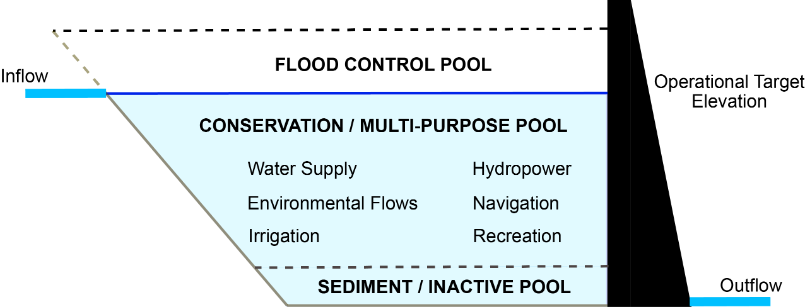
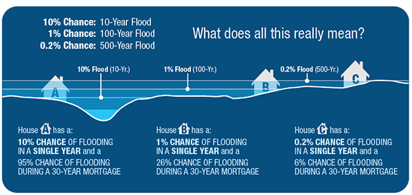

<style type="text/css">

body{ /* Normal  */
      font-size: 18px;
  }
</style>

```{r setup, include=FALSE}
knitr::opts_chunk$set(echo = TRUE)
```

#Unit 1: Analysis of Flood Return Interval Using Rcran

##Background: Calculating return intervals

Our team hydrologist suggested that one method for evaluating the impacts of dam construction is to monitor changes in flood return intervals. Falls Lake is a flood control reservoir, so it should decrease the amount of downstream flooding.

 
 
**Figure:** Reservoirs should moderate downstream flows. There is a flood control pool to hold flood waters that can be released slowly over time. There is also a conservation pool that holds water that can be released downstream during drier conditions to meet minimum streamflow requirements.


Flood insurance policy is built around the concept of the 100-year flood event. The housing industry has been working to explain what that risk actually means to homeowners with 30 year mortgages. Understanding the flood risk relative to mortage's is helpful for insurance companies to know. Has Falls Lake decreased the flood risk for downstream homes?



Reservoirs decrease the likelihood of downstream flooding, but that often means development occurs in areas that would have been frequently flooded prior to the reservoir. We've seen examples of this just his year with Hurricane Harvey.


##Framing and executing the analysis

We will use Leopold's (1994) flood frequency curve and the Weibull equation to calculate the recurrence interval. Here the return interval is computed as $\frac{n+1}{m}$ where `n` is the number of years of data and `m` is the rank of the year from largest to smallest.

* *NOTE: The accuracy of a return interval is highly impacted by the length of the time series.*

So, for us to do this analysis, we need to first compute maximum annual discharge, i.e., extract the largest discharge observed from each water year. Next, sort and rank our data on max annual discharge and then compute a regression line from which we can determine the discharge of a 100 and 500 year flood. 


### Prep the workspace by installing (if needed) and loading libraries
The method for installing and loading libraries, as well as downloading data from the USGS, are explained in the `LoadStreamflowDescription.Rmd` file. 

```{r libs, message=FALSE, warning=FALSE}
#install.packages("dataRetrieval", repos=c("http://owi.usgs.gov/R", getOption("repos")))
library(dataRetrieval); library(EGRET); library (ggplot2)
library(dplyr); library(magrittr); library(lubridate)
```

### Download data from NWIS

```{r downloaddata, message=FALSE, warning=FALSE}
#Identify gauge to download
siteNo <- '02087500' #don't forget to add the zero if it is missing

#Identify parameter of interest
pcode = '00060' #discharge (cfs)

#Identify statistic code for daily values
scode = "00003"  #mean

#Identify start and end dates
start.date = "1930-10-01"
end.date = "2017-09-30"

#Load in Ndata using the site ID
neuse <- readNWISdv(siteNumbers = siteNo, parameterCd = pcode, statCd = scode, startDate=start.date, endDate=end.date)
#rename columns to something more useful
neuse <- renameNWISColumns(neuse); colnames(neuse)
#Create cms column to plot cubic meters per second
neuse$Flow_cms <- neuse$Flow*0.028316847

```

<br />

## Calculate the Flood Return Interval using dplyr and pipes
For a basic understanding of variables and pipes, see the `LoadStreamflowDescription.Rmd` file. Here we will use pipes to calculate the maximum daily streamflow within each water year. The water year can be calculated using `ifelse(condition, if true, if false)`, which essentially says if this condition is true then do 'x', otherwise do 'y'. Then use pipes to calculate the peak flow by water year.

```{r peakflow}
#calculate year and month variables
neuse$Year <- year(neuse$Date);  neuse$Month <- month(neuse$Date)

#calculate the Water Year using ifelse
#if the month is greater than 10, then WaterYear = Year+1, else WaterYear=Year
neuse$WaterYear <- ifelse(neuse$Month>=10, neuse$Year+1, neuse$Year)

#Calculate the maximum annual flow
peak.flow <- neuse %>%
  group_by(WaterYear) %>%
  summarise(Peak_cms = max(Flow_cms, na.rm=T), n=n()) %>%  round(3)
peak.flow <- as.data.frame(peak.flow); peak.flow  
```

<br />

* Next, we want to remove years that are missing a lot of data. We arbitrarily decide to throw out any years with less than 90% of the data available: `peak.flow <- subset(peak.flow, n>=(365-365*.1))`

* Then we arrange the peak flows from the largest to the smallest value using `arrange(data, column)` and `desc()` to arrange the values in descending order.

* Add a rank column using the command `rank()`. The `-` symbol in front of `peak.flow` tells R to rank the data with the highest value as (1) and the lowest value as (max n).

* Calculate return intervals in a new column named `ReturnInterval`
    * Determine how many years of data you have (e.g. count of year rows or max of rank).
    * Compute $\frac{n+1}{m}$ where `n` is the number of years of data and `m` is the rank

* Calculate the Annual Exceedance Probability (just the inverse of RI) in a new column named `Pe` where 
  Pe = $\frac{1}{RI}$


```{r RIcalc}
#remove rows missing more than 10% of data
peak.flow <- subset(peak.flow, n>=(365-365*.1))

#rank flows
peak.flow <- arrange(peak.flow, desc(Peak_cms)); peak.flow[1:5,]   #arranges data in descending order based on the Peak_cms column
peak.flow$Rank <- rank(-peak.flow$Peak_cms); peak.flow[1:5,]       #adds a column with rank from 1 to n

#calculate the return internval
n.years <- dim(peak.flow)[1]; n.years
peak.flow$ReturnInterval <- (n.years+1)/peak.flow$Rank; peak.flow[1:5,]
peak.flow$AnnualProb <- round(1/peak.flow$ReturnInterval*100,3);  peak.flow[1:5,]
```

<br />

###Plot the data and compute a regression equation

For more information on commands to plot data, see `LoadStreamflowDescription.Rmd`. The Return Interval (x-axis) and sometimes the Peak Discharge (y-axis) are easier to see on a log plot. We convert the x-axis to log by including the command: `log="x"` in the `plot()` function. To add tick marks and labels on a log axis, we create the ticks manually and add them to the x-axis.

Next we want to estimate the peak discharge at the 100, 200, 500, and 1000 year interval. To do that, we need to fit a regression to the data. We will try two types of regressions: (1) linear and (2) log.

* **Linear** regressions are called using the `lm(formula, data)` command. 
    * `RI.linear = lm(Peak_cms ~ ReturnInterval , data = peak.flow); RI.linear`
    * This returns the coefficients of the regression. To get the significance, standard error, r2 and f-statistic, use `summary(RI.linear)`

* **Log** regressions are also called using `lm()`, except the x-axis (independent) variable is set to `log()`.
    * `RI.log = lm(Peak_cms ~ log(ReturnInterval), data=peak.flow);  summary(RI.log)`

*We notice the log regression has the highest r2 value. Using RI.log we estimate the y-value at the 100, 200, 500 and 1000 year interval using the `predict()` function.


```{r plotRI}
#Plot the return interval with the peak flow
par(mfrow=c(1,1))     #one graph per plot
par(mar = c(5,5,3,5)) #set plot margins
plot(peak.flow$ReturnInterval, peak.flow$Peak_cms, log="x", type='n', yaxt="n", xlim=c(1,1000), ylim=c(0,1000),
     ylab="Peak Streamflow (cms)", xlab = 'Return Interval (Years)')
  axis(2, las=2, cex.axis=0.9)
  #create minor tick marks
  minor.ticks <- c(2,3,4,6,7,8,9,20,30,40,60,70,80,90,200,300,400,600,700,800,900)    
  #add minor tick marks to x-ais
  axis(1,at=minor.ticks,labels=FALSE, col="darkgray")                                
box() #draw a box around the plot
#add points to the plot
  points(peak.flow$ReturnInterval, peak.flow$Peak_cms, col=rgb(0,0,0,0.6), cex=1.2, pch=19)  #add points to plot

#determine whether a linear or log regression has teh best fit...
RI.linear = lm(Peak_cms ~ ReturnInterval , data = peak.flow); RI.linear
  summary(RI.linear)
RI.log = lm(Peak_cms ~ log(ReturnInterval), data=peak.flow)
  summary(RI.log)
  #Log regression had the best fit
#Estimate the streamflow at the following return intervals using the log regression
x.est <- as.data.frame(c(100,200,500,1000)); colnames(x.est)<-"ReturnInterval"
y.est <- predict(RI.log,x.est, interval="confidence")
  y.est <- as.data.frame(y.est)
  y100 = cbind(x.est, y.est);  y100 <- subset(y100, x.est==100)$fit
  y100
  
#Add to plot
points(x.est$ReturnInterval, y.est$fit, col="red", pch=2, lwd=2);
legend("bottomright", c("Observed","Log Estimated"), pch=c(19,2), col=c("darkgray","red"))
```


<br />

## Using functions to calculate the return interval
For more information on how functions work in R, see `LoadStreamflowDescription.Rmd`.  Essentially we take all of the commands from above and stick them inside a function we name `flood_int`. The function will then return a data frame called `peak.flow` with the return interval and annual probabilities included.

```{r}
#create the flood_int function that reads in the data parameter
flood_int = function(data){ 
  #Calculate the maximum annual flow by water year
  peak.flow <- data %>%
    group_by(WaterYear) %>%
    summarise(Peak_cms = max(Flow_cms, na.rm=T), n=n()) %>%  round(3)
  peak.flow <- as.data.frame(peak.flow); 
  #remove rows missing more than 10% of data
  peak.flow <- subset(peak.flow, n>=(365-365*.1))
  
  #rank flows
  peak.flow <- arrange(peak.flow, desc(Peak_cms)); peak.flow[1:5,]
  peak.flow$Rank <- rank(-peak.flow$Peak_cms); peak.flow[1:5,]
  
  #calculate teh return interval
  n.years <- dim(peak.flow)[1]; n.years
  peak.flow$ReturnInterval <- (n.years+1)/peak.flow$Rank; peak.flow[1:5,]
  peak.flow$AnnualProb <- round(1/peak.flow$ReturnInterval*100,3);  peak.flow[1:5,]
  
  #return the data frame so it can be used outside the function
  return (peak.flow)
}

```


<br />

Now we can call this function to calculate the return interval for different periods of time. In this case, we will look at how the return interval has changed prior to 1979 (before Falls Lake reservoir) and after 1984 (following Falls Lake reservoir). 

Call the function flood_int on a subset of the data (pre 1979), run a regression, and plot the data with the original data for the period of record (POR).

  
```{r early ri}
#Call for the early period
neuse.early <- subset(neuse, Date>="1930-01-01" & Date<="1979-12-31");         # summary(neuse.early)
peak.flow.early <- flood_int(neuse.early)   ;
summary(peak.flow.early)  
  
#Basic plot
par(mar = c(5,5,3,5)) #set plot margins
plot(peak.flow.early$ReturnInterval, peak.flow.early$Peak_cms, log="x", type='n', yaxt="n", xlim=c(1,1000), ylim=c(0,1000),
     ylab="Peak Streamflow (cms)", xlab = 'Return Interval (Years)')
axis(2, las=2, cex.axis=0.9)
axis(1,at=minor.ticks,labels=FALSE, col="darkgray")                                 
  box()

#plot original data 
points(peak.flow$ReturnInterval, peak.flow$Peak_cms, col=rgb(0,0,1,0.5), cex=0.8, pch=19)    
#plot early period data
points(peak.flow.early$ReturnInterval, peak.flow.early$Peak_cms, col=rgb(0,0,0,0.6), cex=1.2, pch=19)  
 
#linear regression
RI.linear.early = lm(Peak_cms ~ ReturnInterval , data = peak.flow.early);
  summary(RI.linear.early)
RI.log.early = lm(Peak_cms ~ log(ReturnInterval), data=peak.flow.early)
  summary(RI.log.early) 
  
#plot log line
  x.est <- as.data.frame(c(100,200,500,1000)); colnames(x.est)<-"ReturnInterval"
  y.est.pre <- predict(RI.log.early,x.est, interval="confidence")
  y.est.pre <- as.data.frame(y.est.pre)

#Add regression ponits
points(x.est$ReturnInterval, y.est$fit, col="black", pch=5, lwd=2);  #original POR
points(x.est$ReturnInterval, y.est.pre$fit, col="blue", pch=2, lwd=2);  #early 

#add straight lines at points of interest
    abline(h=y.est.pre$fit[1], col="black", lty=3); abline(v=100, col="red", lty=3)
    abline(h=y100, col="blue", lty=3)

#add a legend
legend("bottomright", c("Period of Record","1930-1979 data", "Est. Flow POR", "Est.Flow 1930-1979"), col=c("blue","black","blue","black"), pch=c(19,19,2,5))
```  
  
<br />

### Call the function for on a subset of data (post 1984)

```{r late ri}
neuse.late <- subset(neuse, Date>="1984-01-01");         # summary(neuse.late)
peak.flow.late <- flood_int(neuse.late)   ;
summary(peak.flow.late)  

#Basic plot
par(mar = c(5,5,3,5)) #set plot margins
plot(peak.flow.late$ReturnInterval, peak.flow.late$Peak_cms, log="x", type='n', yaxt="n", xlim=c(1,1000), ylim=c(0,1000),
     ylab="Peak Streamflow (cms)", xlab = 'Return Interval (Years)')
axis(2, las=2, cex.axis=0.9)
axis(1,at=minor.ticks,labels=FALSE, col="darkgray")                                 
box()

#plot original data
points(peak.flow$ReturnInterval, peak.flow$Peak_cms, col=rgb(0,0,1,0.5), cex=0.8, pch=19)  
#plot post 1984 data
points(peak.flow.late$ReturnInterval, peak.flow.late$Peak_cms, col=rgb(0.7,0.4,0,0.6), cex=1.2, pch=19)  

#linear regression on post 1984
RI.linear.late = lm(Peak_cms ~ ReturnInterval , data = peak.flow.late);
  summary(RI.linear.late)
RI.log.late = lm(Peak_cms ~ log(ReturnInterval), data=peak.flow.late)
  summary(RI.log.late) 

#plot regression log line
y.est.post <- predict(RI.log.late,x.est, interval="confidence")
  y.est.post <- as.data.frame(y.est.post)
points(x.est$ReturnInterval, y.est.post$fit, col="goldenrod3", pch=12, lwd=2);
#plot original regression
points(x.est$ReturnInterval, y.est$fit, col="blue", pch=2, lwd=2);
#plot early return interval
points(x.est$ReturnInterval, y.est.pre$fit, col="black", pch=5, lwd=2);

#draw ablines
abline(h=c(y100,y.est.pre$fit[1],y.est.post$fit[1]), col=c("blue","black","goldenrod3"), lty=3);
abline(v=100, col="black", lty=3)

legend("bottomright", c("Period of Record","1984-2017 data", "Est. Flow POR", "Est.Flow 1930-1979", "Est.Flow 1984-2017", "Est. Flow No Hurricane"), 
       col=c("blue","goldenrod3","blue","black","goldenrod3","red"), pch=c(19,19,2,5,12,16))

#remove 3 hurricane events
RI.log.hur <- lm(Peak_cms ~log(ReturnInterval), data=peak.flow.late[c(4:dim(peak.flow.late)[1]),])
  y.est.hur <- as.data.frame(predict(RI.log.hur,x.est, interval="confidence")); y.est.hur
#plot hurricane
  points(x.est$ReturnInterval, y.est.hur$fit, col="red", pch=16, lwd=2);
  abline(h=y.est.hur$fit[1], col="red", lty=3)
```

<br /> 

### Create Return Interval Table
A table may be the easiest way to compare return intervals. To do this, create a data frame and fill in the desired values. Here we want the 100, 500, and 1000 year intervals. The number of years used to calculate the return interval and the adjusted r2.

```{r RI Table}
#create data frame
RI.table <- as.data.frame(matrix(nrow=4, ncol=6));    
#give column names
colnames(RI.table) <- c("Date.Range", "RI_100yr","RI_500yr","RI_1000yr","Nyears","AdjustedR2")

#fill in columns
  RI.table$Date.Range <- c("1930-2017","1930-1979","1984-2017","Less 3 Hurricanes")
  RI.table$RI_100yr <- c(y.est$fit[1],y.est.pre$fit[1],y.est.post$fit[1], y.est.hur$fit[1])
  RI.table$RI_500yr <- c(y.est$fit[3],y.est.pre$fit[3],y.est.post$fit[3], y.est.hur$fit[3])
  RI.table$RI_1000yr <- c(y.est$fit[4],y.est.pre$fit[4],y.est.post$fit[4], y.est.hur$fit[4])
  RI.table$Nyears <- c(dim(peak.flow)[1], dim(peak.flow.early)[1], dim(peak.flow.late)[1], dim(peak.flow.late)[1]-3)
  RI.table$AdjustedR2 <- c(summary(RI.log)$adj.r.squared, summary(RI.log.early)$adj.r.squared, 
                          summary(RI.log.late)$adj.r.squared, summary(RI.log.hur)$adj.r.squared)
#view table
RI.table
```

<br />

###Calculate the probability of an event in a 30 year mortgage

* Compute the the probability of the 100, 500, and 1,000 year flood occurring over the next 30 years as a binomial distribution: Pe = 1 - [1-$frac/{1}{T}$)]^n where `T` is the return period (e.g. 100 years) and `n` is the number of years of interest (30 years in our case).
* To do this, we will use a `for` loop and print the results using `print()`. The `paste0()` function concatenates information into a string without including spaces. If you want to include spaces, simply use `paste()`.

```{r mortgage}
#What's the probability of these events occurring in a 30 year mortgage??
Rperiod = c(100,500,1000)
n.years = 30
for (i in 1:3){
  print(paste0("Percent likelihood over ", n.years, " years for a ", Rperiod[i]," year flood: ", round((1-(1-(1/Rperiod[i]))^n.years)*100,2), "%"))
}

```


