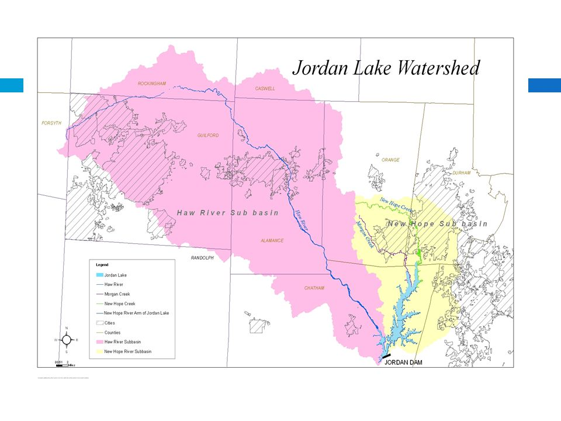
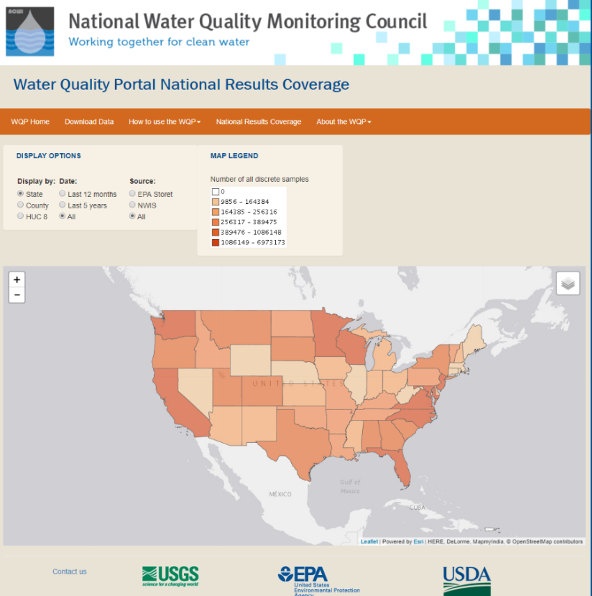
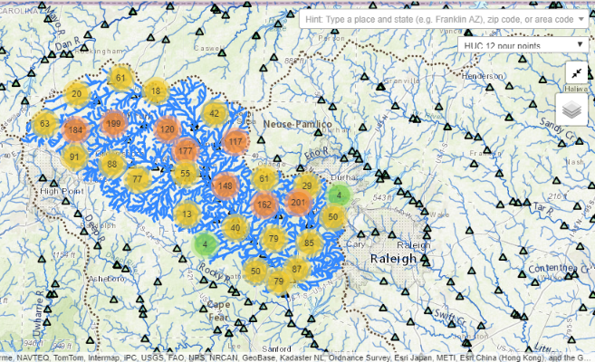
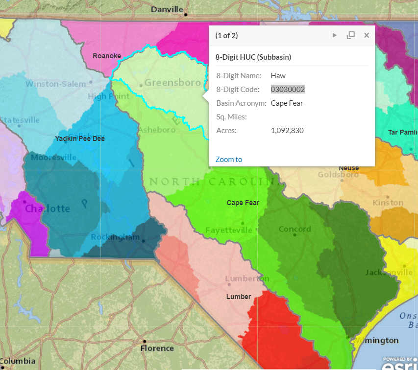
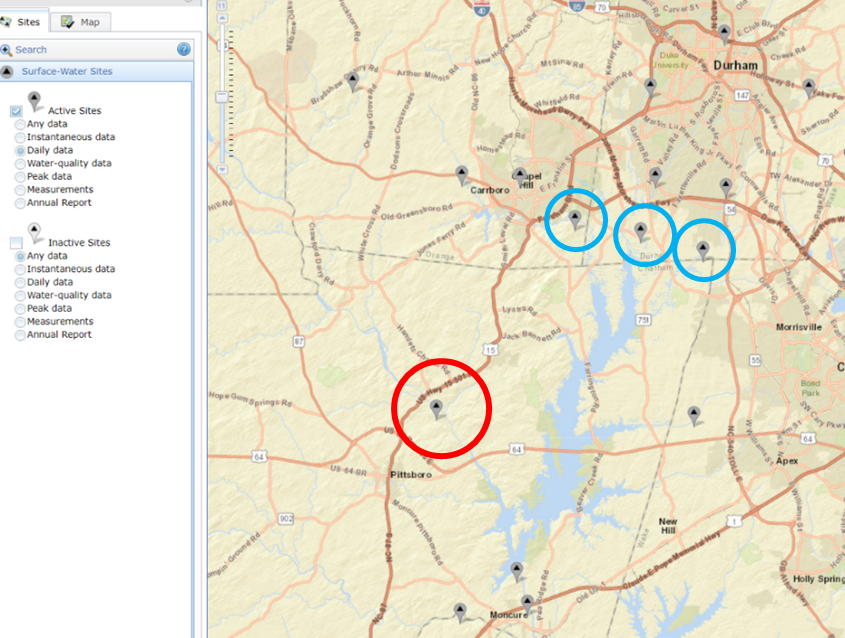

# Unit 3 - Part 2: Bringing it all together

## Task: Water Quality Monitoring in Jordan Lake, NC

In North Carolina, both Falls Lake and Jordan Lake have experienced high nutrient concentrations. A series of rules have been passed with the goal of reducing nutrient loads by setting annual loads on the amount of Nitrogen (and Phosphorus) that are allowed to enter the lake annually. We want to know **how successful have these rules been at reducing Nitrogen loads into Jordan Lake**. 

To answer this, we'll obtain data and construct a visualization of...

### Background...

The rules set for Jordan Lake set two different targets based on the arm of the lake.

- **Upper New Hope**: 641,021 pounds of Nitrogen per year
- **Haw River**: 2,567,000 pounds of Nitrogen per year.

Finding data on nutrient levels and thresholds can be challenging. I found the following sources. You may find many more.

- <https://www.epa.gov/nutrient-policy-data/progress-towards-adopting-total-nitrogen-and-total-phosphorus-numeric-water>
- <https://www.epa.gov/sites/production/files/2014-12/documents/nc-classifications-wqs.pdf>
- <https://deq.nc.gov/nc-stdstable-09222017>
- <http://www.orangecountync.gov/document_center/PlanningInspections/Fallsrulesfactsheet.pdf>

### Obtaining the data

#### Finding water quality information for Jordan Lake

To answer this question, you need to find water quality information. The National Water Quality Monitoring Council has a Water Quality Portal (WQP) that uses Water Quality Exchange (WQX) standards to integrate publicly available water quality data from USGS NWIS, EPA STORET, and the USDS STEWARDS databases. Other data are included from state, federal, tribal, and local agencies. It's a great starting point for water quality data.

- Go to the national water quality data portal: https://www.waterqualitydata.us/portal/

  *Notice that you can search for data based on location, parameters, characteristics, etc. This can be overwhelming if you aren't a water quality expert. The best way to start is by <u>filtering</u>. We know we want the nitrogen loads entering Jordan Lake so let's **filter by location** and **select those sites upstream of Jordan Lake**. To do this we need to know the basin code (HUC).*

  > There is a beta version being tested that allows you to click a point on the map and it will trace upstream (or downstream) and grab all the data upstream (can also filter in the above drop-down boxes). To learn more about this, search `Network Linked Data Index, NLDI`.
  >
  > *It's good to know how to find your basin though so we will search the old-fashioned way...*

- **See if you can figure out what HUC8 Jordan Lake belongs to.** 

  - What are some of the sources you looked at?

  - One spot that I looked for was the *NC Department of Natural Resources* website. They have put together an ArcGIS platform to facilitate data sharing.

    - http://data-ncdenr.opendata.arcgis.com/

    - From this website, I found Jordan Lake belonged to the Haw sub-basin: `03030002`

      

#### Download the Data

Now that we have the HUC8 for Jordan Lake, we can return to the NWQMC site and query data for Jordan Lake. We know we want to download <u>nitrogen</u> data and that nitrogen is a nutrient. How would you narrow down the number of sites?

- - State: `North Carolina`
  - Site Type: `Lake, Reservoir, Impoundment and Stream`
  - HUC: `03030002`
  - Sample Media: `Water`
  - Characteristic Group: `Nutrient`
  - Date Range: `01-01-1970`, `12-31-2017`
  - Minimum results per site: `500`

- **Make sure to keep notes of your download selections for replication purposes**

  - *One option is to click on the `Show Web Service Calls` button at the bottom of the page and the copy the URL generated by your query. This can be helpful if we want to download the same dataset programmatically using R or Python...*

- Click `Show sites on map`

  - When I ran this in January I found 91 sites

    Download the sites data as a comma separated file

- Download the Sample Results (physical/chemical metadata) as a csv

  - We download this as a CSV because we need to do some cleaning first and with large data files it is easier to do that in a scripting environment (such as R or Python).

------

## Exploratory Data Analysis in R

Go to the `TotalNitrogen.Rmd` file to follow along with how we are going to clean the data and prepare it for visualization. Data exploration can also help us better understand the underlying data and the story we wish to tell with the data.

##### Data Cleaning

Some of the things you might want to do to clean the data include:

- Load in the site data and plot a map to see where water quality data were present from this portal.
- Load in the results data and do some cleaning:
  - We want to make sure we are using routine samples and not extreme event sampling (biased for specific occasions and not for estimating annual average load).
  - Determine what type of Nitrogen we want to use. From the literature we found that regulations for Nitrogen include: nitrate, nitrite, ammonia and organic forms. Doing some reading about the WQX standards, you learn that `Nitrogen, mixed froms` incorporates all of the above forms of nitrogen. Filter the data to only include those results.
- We also want to make sure we are looking at total Nitrogen, so make sure the Results Sample Fraction Text only includes those with `Total`.
- Detection Limits and Measurement Units
  - You may have noticed that many sample sites state “not detected”. This is important data that are not currently being represented. Create a new column and set the value equal to the results, unless it is below the detection limit – in which case set it equal to ½ of the detection limit.
  - You may also have noted that the total nitrogen was sometimes reported as `mg/l` or `mg/l NO3`. We want `mg/l`. Convert `mg/l NO3` `to mg/l`
    - The atomic weight of nitrogen is 14.0067 and the molar mass of the nitrate anion(NO3) is 62.0049 g/mole. Therefore to convert Nitrate-NO3 to Nitrate-N:
      - `Nitrate-N(mg/L) = (14.0067/62.0049)*Nitrate-NO3 (mg/l)`

##### Data Exploration

Refer to the `TotalNitrogen.Rmd` for ways that we chose to explore the data. Feel free to create your own exploratory analysis.

##### Calculating Annual Load to Compare with Thresholds

Now let’s look at how the Haw River and New HopeRiver thresholds are doing. The water quality data reports Nitrogen as mg/l. Inorder to convert to an annual load (lbs/yr), we need to know the volume ofwater flowing through each site. Go to the NWIS Mapper to find which USGSgauges are closest to:

* USGS-0209699999 (Haw River Arm)
* USGS-0209768310 (New Hope Arm)

**Figure: **NWIS mapper USGS gauges near water quality monitoring sites. The red circle is the
gauge of interest for the Haw River Branch. The blue circles are the gauges of interest for New Hope Creek.

For specific details, refer to `TotalNitrogen.Rmd`

- Use `readNWISdv` to download the daily discharge for the Haw River.
- Plot the USGS site and the water quality site together to see how close they are and if any major tributaries intersect between them.
- Convert flow to MGD and calculate the total annual flow.
- Calculate the average annual nitrate (mg/l).
- Merge the annual discharge and nitrate load together. Calculate the pounds of nitrate per year based on the flow (rough estimate).
  - Pounds = Annual Flow * Average N * lbspergal (water is 8.34 pounds per gallon)

- Repeat this process for the Upper New Hope Creek. 
  - Take the sum of the flow for all three sites over a year.
  -  Notice that the lbs are far below the threshold.Why might that be?
    - The drainage area for Jordan lake is 1689 mi2
    - The Haw River site accounted for 1,275 mi2
    - The three sites on for New Hope Creek accounted for 76.9, 21.2, and 41 mi2
  - The downstream site on the right accounts for 12mi2
  - This leaves 402 mi2 unaccounted for
- Let’s assume that 75% of this is being missed and should be included in the analysis. Adjust the pounds accordingly and plot both on the graph.

Write files out in csv to be loaded into RShiny, Python, Javascript, or Tableau….

------

## Visualize Data in Tableau

Now that you know a little about how Tableau works - create a story board for water quality data in the Jordan Lake. Be as creative as you'd like. Below is one possibility:

[Nitrogen Flowing into Jordan Lake](https://public.tableau.com/profile/lauren3839#!/vizhome/Unit3-Nitrogen/Story1?publish=yes)

