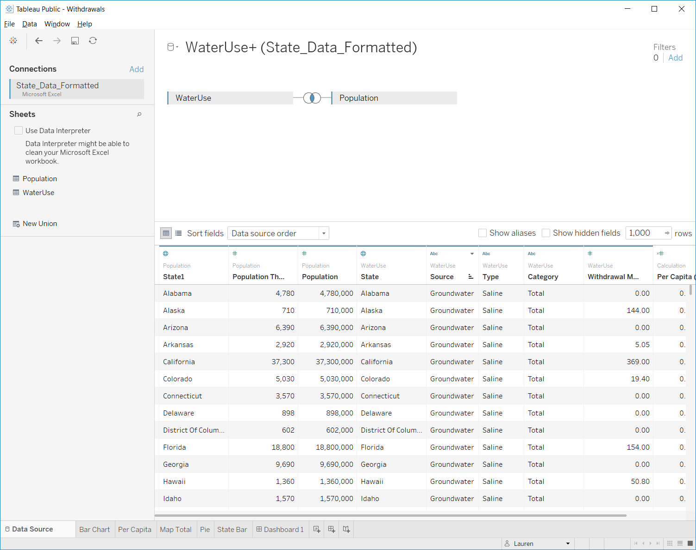
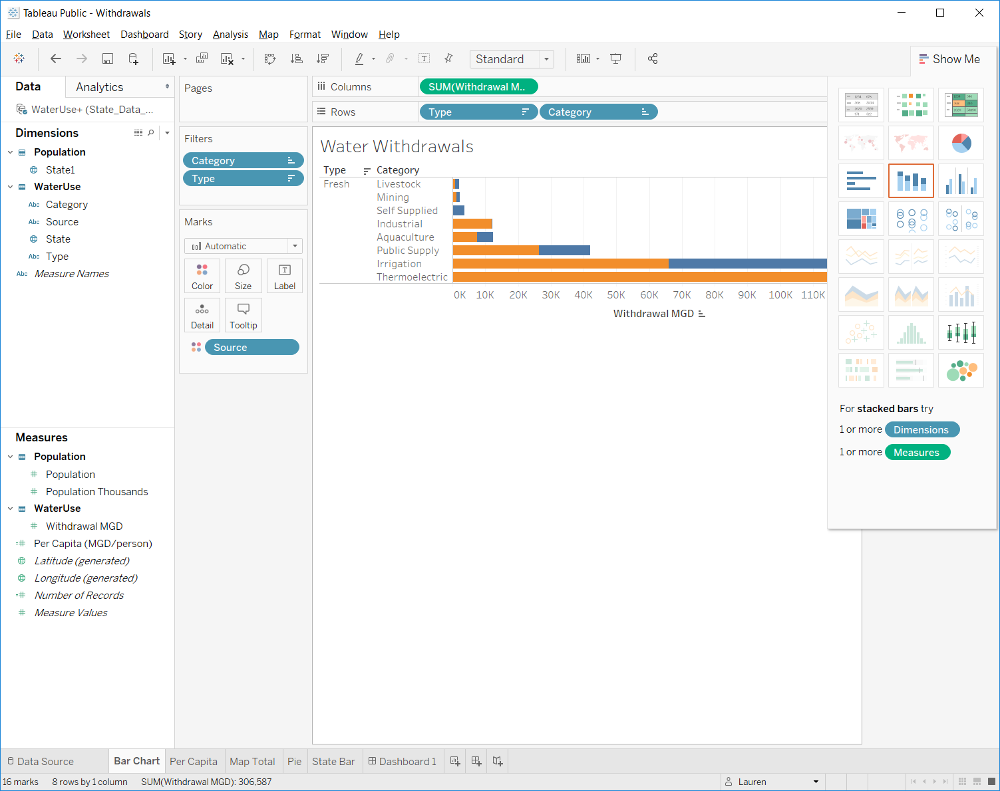
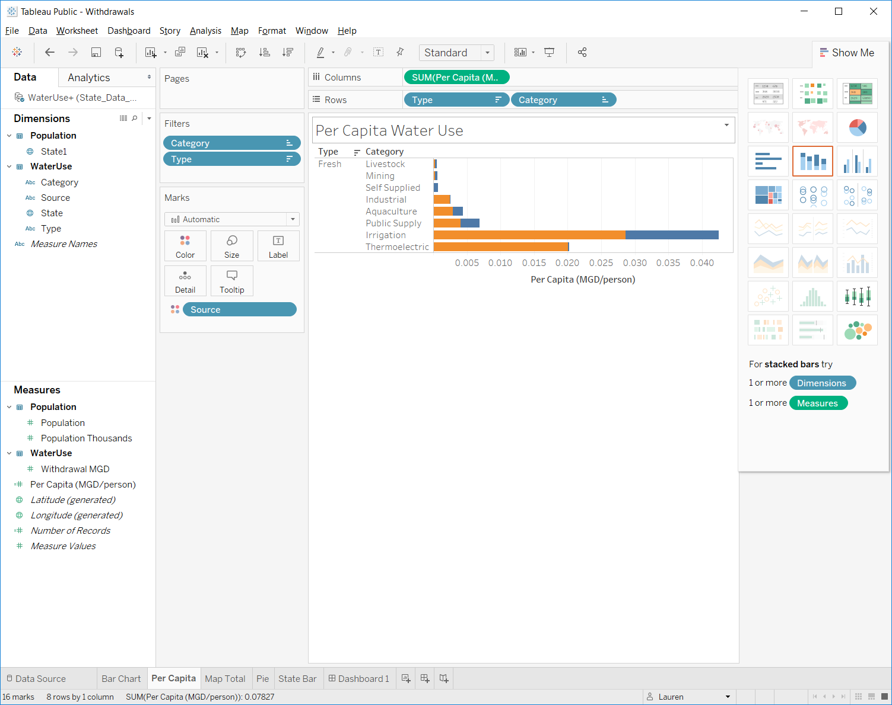
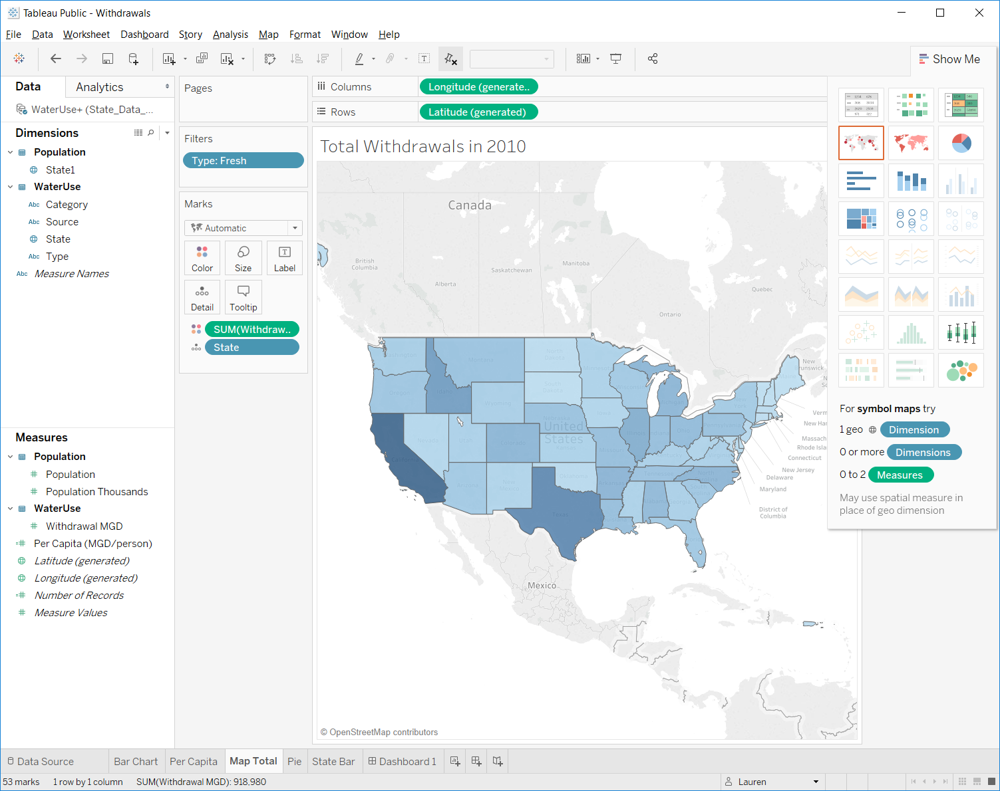
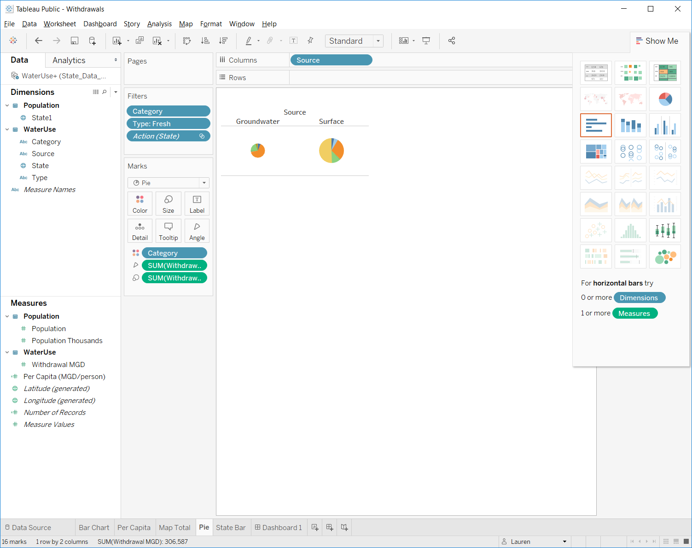
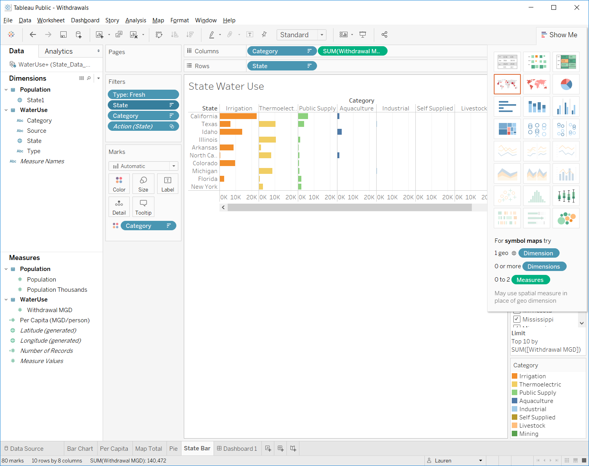
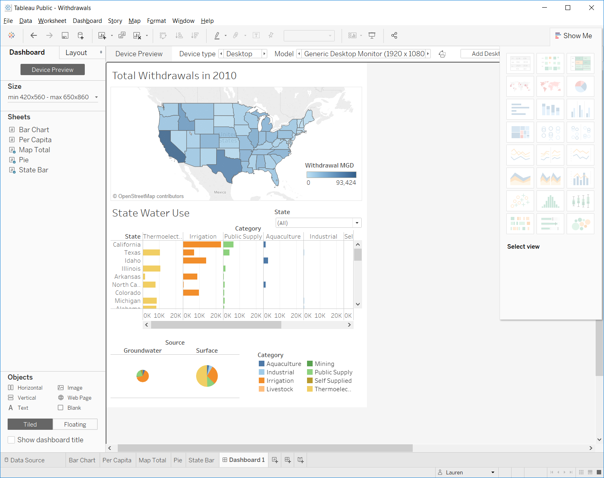

# Unit 3: Visualizing Data in Tableau

[TOC]

## ♦ Background

Data visualizations are the modern equivalent of visual communication with the goal of better communicating numerical information to an audience. Interactive visualizations allow the audience to explore and engage with the data that is of particular interest to them. Effective visualizations make complex data more accessible, understandable, and usable.

There are a plethora of tools to help researchers display their data to a broader audience. Some of these tools are:

- Shiny R: https://shiny.rstudio.com/

  - Shiny is an R package that enables users to build interactive web apps within R by accessing html and javascript libraries.

- Python: many libraries (such as Bokeh and pandas) can be used to create interactive data visualizations. Python also has tools such as:

  - Dash - https://medium.com/@plotlygraphs/introducing-dash-5ecf7191b503

- Tethys Platform: http://www.tethysplatform.org/

  - Uses Python to create interactive data visualizations specifically around water resources

- Tableau: https://www.tableau.com/

  Uses spreadsheets (such as Excel) to create data visualizations and storyboards. 

In the interest of time, we are going to explore **tableau**.

------

## ♦ Exploring Water Use Data

### Water Use Overview

The USGS collects and reports water use on 5-year intervals. The latest data released was from 2010. Go to the USGS Water Use website (https://water.usgs.gov/watuse/). Notice they provide some overviews of the data. Click on the different overviews. What do you notice? Is this information helpful? Would this information be more engaging if we could explore different state water use?

### Obtaining the data + spreadsheet etiquette

From the website, download the state data for 2010. Open the file. What do you notice?

1. Based on what we have done the past two weeks, is this type of spreadsheet particularly usable? Why or why not?

   1. This is a frequent problem with water data. 

      You might be able to discover the data, but the data are not in a format that is immediately usable.

   2. How would you reorganize the data to be more usable?

Due to the shortness of time, I have already reorganized the data into a usable format for Tableau. Open the `State_Data_Formatted.xlsx`. 

---

## ♦ Tableau

### Loading data into Tableau

- #### Tableau accepts several types of data formats, including excel spreadsheets. You can also connect to servers, including `Google Sheets`.

  - Select `Microsoft Excel` under the `Connect` menu. Navigate to where the data are held.

- On the left-hand side we see that we are connected to the `State_Data_Formatted.xlsx` spreadsheet. Underneath the connection you see both `worksheets`. Drag the `WaterUse` sheet into the top right panel.

- Make sure the data loaded into Tableau correctly

  - Data Column Headers

  - Data Types

    - Geographic types are pre-loaded into Tableau

    ​

- Connect the WaterUse Sheet with the Population Sheet.

  - Drag the population sheet into the top right
  - Types of joins
  - Select the fields to link too: `State`
    - Linking population and water use data together will allow us to calculate the per-capita water use later on.

### Tableau Components

- Access different components of Tableau on the bottom row.
  - `Data Source` - the raw data we load into Tableau
  - `Worksheet` - spreadsheets where we create visualizations to explore the data
  - `Dashboard` - organize visualizations onto a page. Can set up connectivity and interaction of different charts.
  - `New Story` - organize dashboard(s) in an order to walk users through the analysis

#### Worksheets

- `Data` Tab

  - Dimensions are discrete data

  - Measures are continuous data

    - Italicized variables are calculated by Tableau on the fly

  - You can change how data are categorized, i.e. dimension or measures by dragging or right clicking the variable and selecting the operation you want to perform.

    ​

- Drag `Withdrawals MGD` into the sheet. What do you see?

  - Tableau will always summarize information. You can then ask it to break out that information into categories.
    - Drag `Source` into the `columns`. You can think of columns as your `x-axis` and rows as your `y-axis` in terms of how the data will be displayed.
      - How else can you summarize the data?
        - Drag `Type` into the column header.
          - Notice that as you drag information over, new charts begin to come up. These are different options that Tableau recommends for displaying the information.
        - Drag `Category` into the `Rows` tab
  - Create a `bar` chart. How did Tableau organize the information?
    - How did it order the chart?
    - It's a little hard to see - what if we flipped the orientation?
      - Notice that `Total` is making the `Withdrawal` axis very long. Remove the `Total` column.
        - Click on `Total` and click `exclude`
      - Let's focus only on freshwater. Can you exclude `Saline`?
    - Can you sort the column data from descending to ascending?
  - Name your worksheet something meaningful

- Create a new worksheet and this time let's plot per capita water withdrawals.

  - `Duplicate` the bar chart
  - Under `Measures`, click on `Withdrawal MGD`. Click `Create`, `calculated field`
    - Calculate the per-capita water use (mgd/person)
      - Do this by dragging the fields into the calculation box
        - `[Withdrawal MGD] / [Population]`
  - Drag `Per Capita (MGD/person)` field into the columns chart to replace the `SUM(Withdrawal MGD)`

  

  ​

##### Recreate the charts on the USGS website

- In the total water use column, the first thing we see is a map of the U.S.
  - In Tableau, create a new worksheet and title it `Map Total`
    - Drag `State` into the worksheet.
    - Let's create a color map based on `Withdrawal MGD` by dragging the field over the `color` icon.
      - You can click on colors to edit.
      - The USGS used `Stepped` color, meaning the colors are broken into discrete categories. Tableau naturally uses a `continous` color range. What are the pros / cons of using each. Look at the USGS map for comparison. 
        - There's not a right or wrong answer. Pick the one you want to use.
    - Let's only look at `freshwater` totals. Use the `filters` box to exclude `Saline`.
  - How does the map change if you look at per capita withdrawals?

- The next chart shown is a pie chart by category. Create a new worksheet and draw a pie-chart. 
  - Filter it to only look at `freshwater` and exclude 'Total'. 
  - What other charts might convey this information better than a pie chart?

- The last chart is a bar chart by state and category.
  - Create a new worksheet and create a bar chart by state
    - Drag `Category` into the columns along with `Withdrawal`
    - Filter for `Fresh`
    - Sort by `Total Withdrawals` 
    - Show only the top 10 states
    - Can you think of how you might sort the display of categories from most used to least used?

### Dashboards

- Now that we've created the data visualizations, we can organize the visualizations onto a dashboard.

- Add a `Dashboard` sheet

  - Notice that instead of seeing your data on the left-hand side, you now see the data visualizations you have created. 

- Add your map to the dashboard

- Add in the pie chart and the State Water Use chart

  - Notice you can undock and delete some of the legends.
  - You can also change legends from full lists to drop down menus.

- Rearrange these three plots however you would like.

  - Notice that the Map and the State Water Use bar charts could be linked together by state.
  - Click on the state map. Click on the bottom arrow and click `use as filter`.
    - Click on a state. What happens to the bar chart and the pie chart?
      - Why does the bar chart not seem to work correctly?
        - Go to the `State Bar` worksheet and turn off the `Top 10 filter`. 
          - Now try selecting multiple states.
  - Save the workbook

  - Sometimes you will get an error saying it failed to saved the workbook. Click `open from Tableau Public`. This will let you sign in and you will see an older version of your workbook. Close that and then try to save your workbook again.

### Storyboards

A storyboard allows you to merge together multiple dashboards or charts to progressively lead a reader through a process of understanding their data.

Storyboard is similar to the dashboard, except you can also include dashboards. Each caption box at the top represents an html page. Arrange your plots and captions, add text, and tell a story about the data. Here's one example:

------

# Bringing it all together

## ♦ Water Quality Data

### Question

In North Carolina, both Falls Lake and Jordan Lake have experienced high nutrient concentrations. A series of rules have been passed with the goal of reducing nutrient loads by setting annual loads on the amount of Nitrogen (and Phosphorus) that are allowed to enter the lake annually. We want to know how successful these rules have been at reducing Nitrogen loads into Jordan Lake. The rules set for Jordan Lake set two different targets based on the arm of the lake.

- **Upper New Hope**: 641,021 pounds of Nitrogen per year
- **Haw River**: 2,567,000 pounds of Nitrogen per year.

Finding data on nutrient levels and thresholds can be challenging. I found the following sources. You may find many more.

- <https://www.epa.gov/nutrient-policy-data/progress-towards-adopting-total-nitrogen-and-total-phosphorus-numeric-water>
- <https://www.epa.gov/sites/production/files/2014-12/documents/nc-classifications-wqs.pdf>
- <https://deq.nc.gov/nc-stdstable-09222017>
- <http://www.orangecountync.gov/document_center/PlanningInspections/Fallsrulesfactsheet.pdf>

### Obtaining the data

To answer this question, you need to find water quality information. The National Water Quality Monitoring Council has a Water Quality Portal (WQP) that uses Water Quality Exchange (WQX) standards to integrate publicly available water quality data from USGS NWIS, EPA STORET, and the USDS STEWARDS databases. Other data are included from state, federal, tribal, and local agencies. It's a great starting point for water quality data.

- Go to the national water quality data portal: https://www.waterqualitydata.us/portal/

  - Notice that you can search for data based on location, parameters, characteristics, etc. This can be overwhelming if you aren't a water quality expert. The best way to start is by filtering. We know we want the nitrogen loads entering Jordan Lake so lets filter by location and select those sites upstream of Jordan Lake. To do this we need to know the basin code (HUC).

    - There is a beta version being tested that allows you to click a point on the map and it will trace upstream (or downstream) and grab all the data upstream (can also filter in the above drop-down boxes). To learn more about this, search `Network Linked Data Index, NLDI`.

      

      - It's good to know how to find your basin though so we will search the old-fashioned way.

        ​

  - Take a moment to see if you can figure out what HUC8 Jordan Lake belongs to. What are some of the sources you looked at?

    - One spot that I looked for was the NC Department of Natural Resources website. They have put together an arcgis platform to facilitate data sharing.

      - http://data-ncdenr.opendata.arcgis.com/

      - From this website, I found Jordan Lake belonged to the Haw sub-basin: `03030002`

        

#### Download the Data

- We know we want to download nitrogen data and that nitrogen is a nutrient. How would you narrow down the number of sites?

  - State: `North Carolina`
  - Site Type: `Lake, Reservoir, Impoundment and Stream`
  - HUC: `03030002`
  - Sample Media: `Water`
  - Characteristic Group: `Nutrient`
  - Date Range: `01-01-1970`, `12-31-2017`
  - Minimum results per site: `500`

- **Make sure to keep notes of your download selections for replication purposes**

- Click `Show sites on map`

  - When I ran this in January I found 91 sites

    Download the sites data as a comma separated file

- Download the Sample Results (physical/chemical metadata) as a csv

  - We download this as a CSV because we need to do some cleaning first and with large data files it is easier to do that in a scripting environment (such as R or Python).

------

## Exploratory Data Analysis in R

Go to the `TotalNitrogen.Rmd` file to follow along with how we are going to clean the data and prepare it for visualization. Data exploration can also help us better understand the underlying data and the story we wish to tell with the data.

##### Data Cleaning

Some of the things you might want to do to clean the data include:

- Load in the site data and plot a map to see where water quality data were present from this portal.
- Load in the results data and do some cleaning:
  - We want to make sure we are using routine samples and not extreme event sampling (biased for specific occasions and not for estimating annual average load).
  - Determine what type of Nitrogen we want to use. From the literature we found that regulations for Nitrogen include: nitrate, nitrite, ammonia and organic forms. Doing some reading about the WQX standards, you learn that `Nitrogen, mixed froms` incorporates all of the above forms of nitrogen. Filter the data to only include those results.
- We also want to make sure we are looking at total Nitrogen, so make sure the Results Sample Fraction Text only includes those with `Total`.
- Detection Limits and Measurement Units
  - You may have noticed that many sample sites state “not detected”. This is important data that are not currently being represented. Create a new column and set the value equal to the results, unless it is below the detection limit – in which case set it equal to ½ of the detection limit.
  - You may also have noted that the total nitrogen was sometimes reported as `mg/l` or `mg/l NO3`. We want `mg/l`. Convert `mg/l NO3` `to mg/l`
    - The atomic weight of nitrogen is 14.0067 and the molar mass of the nitrate anion(NO3) is 62.0049 g/mole. Therefore to convert Nitrate-NO3 to Nitrate-N:
      - `Nitrate-N(mg/L) = (14.0067/62.0049)*Nitrate-NO3 (mg/l)`

##### Data Exploration

Refer to the `TotalNitrogen.Rmd` for ways that we chose to explore the data. Feel free to create your own exploratory analysis.

##### Calculating Annual Load to Compare with Thresholds

Now let’s look at how the Haw River and New HopeRiver thresholds are doing. The water quality data reports Nitrogen as mg/l. Inorder to convert to an annual load (lbs/yr), we need to know the volume ofwater flowing through each site. Go to the NWIS Mapper to find which USGSgauges are closest to:

* USGS-0209699999 (Haw River Arm)
* USGS-0209768310 (New Hope Arm)

**Figure: **NWIS mapper USGS gauges near water quality monitoring sites. The red circle is the
gauge of interest for the Haw River Branch. The blue circles are the gauges of interest for New Hope Creek.

For specific details, refer to `TotalNitrogen.Rmd`

- Use `readNWISdv` to download the daily discharge for the Haw River.
- Plot the USGS site and the water quality site together to see how close they are and if any major tributaries intersect between them.
- Convert flow to MGD and calculate the total annual flow.
- Calculate the average annual nitrate (mg/l).
- Merge the annual discharge and nitrate load together. Calculate the pounds of nitrate per year based on the flow (rough estimate).
  - Pounds = Annual Flow * Average N * lbspergal (water is 8.34 pounds per gallon)

 

- Repeat this process for the Upper New Hope Creek. 
  - Take the sum of the flow for all three sites over a year.
  -  Notice that the lbs are far below the threshold.Why might that be?
    - The drainage area for Jordan lake is 1689 mi2
    - The Haw River site accounted for 1,275 mi2
    - The three sites on for New Hope Creek accounted for 76.9, 21.2, and 41 mi2
  - The downstream site on the right accounts for 12mi2
  - This leaves 402 mi2 unaccounted for
- Let’s assume that 75% of this is being missed and should be included in the analysis. Adjust the pounds accordingly and plot both on the graph.

 

Write files out in csv to be loaded into RShiny, Python, Javascript, or Tableau….

------

## Visualize Data in Tableau

Now that you know a little about how Tableau works - create a story board for water quality data in the Jordan Lake. Be as creative as you'd like. Below is one possibility:

[Nitrogen Flowing into Jordan Lake](https://public.tableau.com/profile/lauren3839#!/vizhome/Unit3-Nitrogen/Story1?publish=yes)

